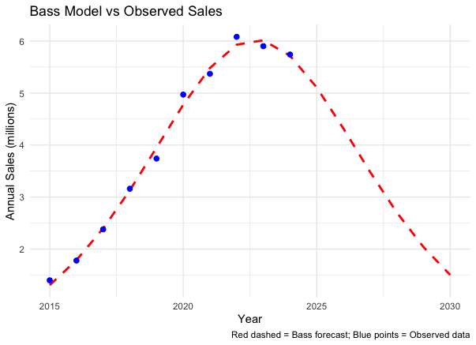

# Innovation Diffusion Analysis: Bimotal Elevate

## 1. Selected Innovation

Bimotal Elevate represents a compact e-bike conversion kit that enables a traditional bicycle to be converted into a motorized one, or in other words, an e-bike. It provides an opportunity to ride from 750 to 1250-watt peak power. Unlike a full e-bike, it attaches easily to bikes and is fully modular, making it shareable across multiple bicycles. The innovation enables riders to travel longer distances and climb hills with less effort.

## 2. Similar Innovation from the Past

As a similar innovation from the past, I chose the Bosch e-bike conversion kit, which was introduced in the 2010s (more specifically in 2011), as a comparable innovation to Bimotal Elevate. Like Bimotal Elevate, it allowed traditional bicycles to be motorized through a drive-unit system. In terms of the comparison, it should be compared in 3 aspects: functionality, technology, and market impact.

### Comparison

**Functionality:** Both innovations share the goal of motorizing bicycles by turning them into e-bikes to help riders cover longer distances, climb hills. However, Bosch kits require permanent installation on a single bike, while Bimotal Elevate is more flexible and lightweight, thus allowing quick attachment and removal across multiple bicycles.

**Technology:** Bosch kits used early-generation motors and batteries, which were heavier and less efficient. Bimotal Elevate uses modern, compact, and efficient motors and batteries, which are developed by industry leaders — ex-Tesla and aerospace engineers, thus improving shareability across bikes and overall user experience.

**Market Impact:** Bosch kits were widely adopted because Bosch is a well-known and trusted brand. Bimotal Elevate, being newer, has less brand recognition, so initial adoption may be slower. However, its lightweight, modular design and professional-grade engineering make it appealing to a wider audience, including recreational cyclists and professionals. This means it has strong potential to reach more users faster.

## 3. Historical Data

As for the historical data, I will use the data retrieved from Statista. More specifically, as I did ot find data about the Bosch e-bike conversion kit, I will use data about overall e-bikes. More specifically, the sales volume of electric bicycles in the European Union from 2015 to 2024. 

## 4. Estimate Bass Model Parameters

From the Bass model estimation using the EU e-bike sales as proxy data.  These parameters indicate the following:

- **p = 0.0148 (coefficient of innovation):** Adoption by innovators is relatively low, meaning only a small fraction of early adopters independently adopt Bimotal Elevate without influence from others.  
- **q = 0.3474 (coefficient of imitation):** Imitation plays a much stronger role, showing that most adopters are influenced by existing users, for example, through the social influence.  
- **M = 63.87 million units (market potential):** The total potential market in the EU is estimated at approximately 63.87 million bicycles that could adopt the Bimotal conversion kit.  

Overall, the diffusion pattern is expected to start slowly with innovators, then grow as imitation effects dominate, eventually approaching market saturation near the estimated M.

## 5. Prediction of the Diffusion

Based on the Bass model:

**Introduction (2015-2018)**  
- Early adopters start using Bimotal Elevate.  
- Sales grow gradually from 1.4 million to 3.16 million units.

**Rapid Growth Phase (2019-2022)**  
- Accelerated adoption due to imitation effects.  
- Sales peak around 6.08 million units in 2022.

**Market Saturation & Decline (2023-2024)**  
- Slower growth or slight decline as market nears saturation.  
- Predicted cumulative adoption approaches the estimated market potential M.

## 6. Choosing a Scope

The diffusion of Bimotal is analyzed at the regional level (EU) because adoption data is mostly reported at the country or regional scale, such as Germany, Belgium, and the Netherlands. This regional focus allows us to capture how the innovation develops and shifts within each country. Additionally, the technological advancement of converting traditional bicycles into electric-assisted models plays a significant role in adoption patterns within these regions. In contrast, a global scope would weaken these important local factors.

## 7. Estimate Number of Adopters by Period

Using the Bass model parameters:

- **Annual adopters** were estimated by taking the yearly difference of cumulative adopters.  
- Cumulative adopters show the total number of users adopting Bimotal over time.  
- This approach allows projecting adoption patterns year by year, highlighting the early adoption phase, growth phase, and approaching market saturation.  

The data and estimates are saved in `bimotal_forecast.csv`, which includes:

- `year`  
- `annual_sales_pred` (Bass model forecast)  
- `annual_sales_real` (observed EU sales)  
- `cumulative_adopters`  
- `annual_adopters`

## 8. Figures

  
*Figure 1: Bass model predictions vs observed annual sales*

  
*Figure 2: Annual Bimotal adopters forecast*

## References

- TIME, The Best Inventions of 2024. [Bimotal Elevate](https://time.com/7094576/bimotal-elevate/)
- Statista. Electric bicycle sales in the European Union (2015–2024).[source](https://www.statista.com/statistics/1353343/electric-bike-sales-europe/)  
- Bosch e-bike kits. [Bosch eBike Systems](https://www.bosch-ebike.com/en/company/product-documentation)  
- Bimotal Elevate official documentation. [Bimotal](https://www.bimotal.com/)

