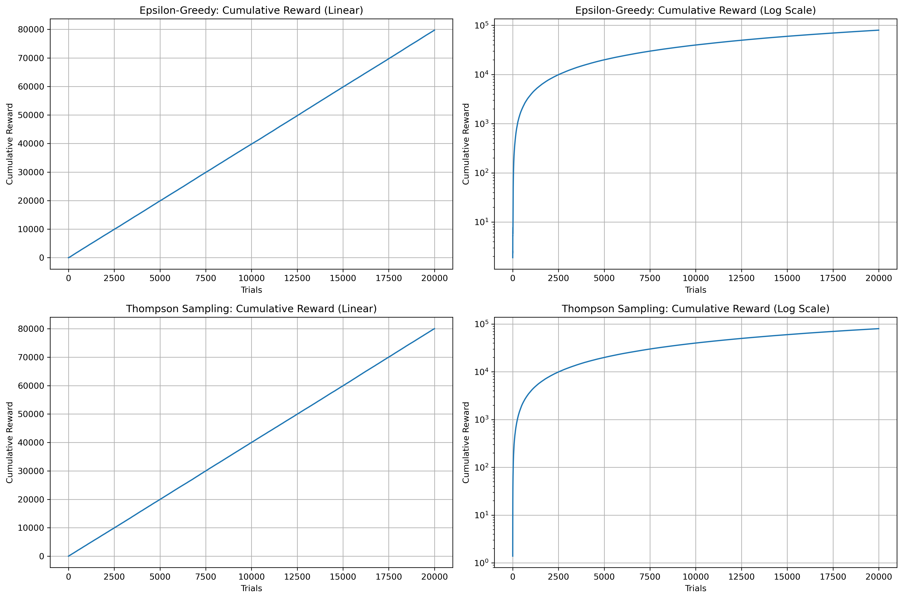
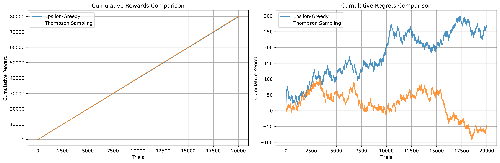

# A/B Testing Scenario — Multi-Armed Bandit Experiment

## 1. Task Description

**Scenario:**

You have four advertisement options (bandits), and your task is to design an experiment using Epsilon-Greedy and Thompson Sampling strategies.

**Design of Experiment**

A Bandit class has already been created for you.
It is an abstract base class with abstract methods.
You must not remove anything from the Bandit() class, but you may add additional functionality if necessary.

**Given Parameters**

Bandit_Reward = [1, 2, 3, 4]

NumberOfTrials = 20000

The values of epsilon (ε) and precision (τ) are chosen by me.

## 2. Reporting and Output

The report() method:
Saves results as CSV to: HW2/data/{Algorithm}_results.csv

Logs:
Total trials
Average reward
Average regret per trial
Total regret
Optimal bandit (True Mean)

### Visualizations

The Visualization class generates and saves plots to: HW2/img/

plot1()
Displays linear and logarithmic cumulative reward charts for:
Epsilon-Greedy
Thompson Sampling

Saved as:
  
*Figure 1: Linear vs Log*

plot2()
Compares cumulative rewards and cumulative regrets between algorithms.

Saved as:
  
*Figure 2: Epsilon Greedy vs Thomson Sampling*

## 3. Comparison

After running both algorithms, the results are visually compared in:
Cumulative Reward Comparison
Cumulative Regret Comparison
These plots demonstrate how Thompson Sampling typically converges faster and with lower regret compared to Epsilon-Greedy.

